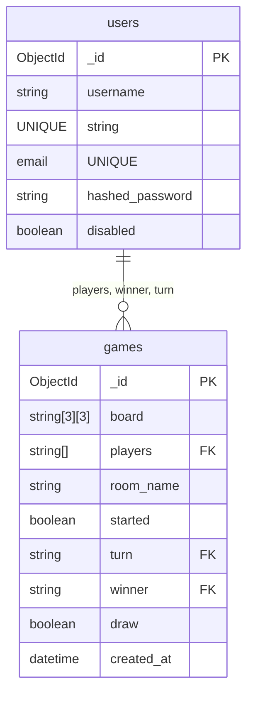

# MongoDB Schema Documentation: Users, Games, and History
This document describes the structure of the collections used in MongoDB for the Tic Tac Toe backend. It is based strictly on the backend logic implemented in the FastAPI application. The collections are: `users`, `games` (which also serves for "history"), and their interrelations.

## 1. users Collection

**Purpose:** Stores registered user accounts with credentials and status flags.

**Fields:**
| Field Name        | Type        | Description                        | Constraints / Validation      |
|-------------------|-------------|-------------------------------------|------------------------------|
| _id               | ObjectId    | MongoDB-generated document ID       | Unique, indexed              |
| username          | string      | User's public username              | Unique, required             |
| email             | string      | User's email address                | Unique, required, format     |
| hashed_password   | string      | Password hash (bcrypt)              | Required                     |
| disabled          | boolean     | Account disabled flag               | Optional, default: false     |

**Validation Expectations:**
- `username`: 3-24 chars, unique (explicit check in code).
- `email`: Unique, must match valid email format.
- `hashed_password`: bcrypt hash.
- `disabled` is not currently validated or indexed, but is Boolean.

**Suggested Indexes:**
- Unique index on `username`
- Unique index on `email`

**Sample Document:**
```json
{
  "_id": ObjectId("65e01234567f2a1b3c4d5e6f"),
  "username": "jane_doe",
  "email": "jane@example.com",
  "hashed_password": "$2b$12$...",
  "disabled": false
}
```

---

## 2. games Collection (includes "history")

**Purpose:** Stores the current state and metadata for ongoing and completed Tic Tac Toe games; also used to query for history.

**Fields:**
| Field Name     | Type              | Description                                   | Constraints / Validation          |
|----------------|-------------------|-----------------------------------------------|-----------------------------------|
| _id            | ObjectId          | MongoDB-generated document ID                  | Primary Key                       |
| board          | array (3x3 grid)  | Game board: 3x3 list of ["", "X", or "O"]     | Always 3x3 grid, never null       |
| players        | array of strings  | List of usernames (1 or 2 players)            | Min 1, max 2, each is user ref    |
| room_name      | string            | User-friendly name for room/game              | Required                          |
| started        | boolean           | Whether game has started (2 players joined)   | Default: false                    |
| turn           | string / null     | Username whose turn it is                     | User reference; can be null       |
| winner         | string / null     | Username of winner                            | User reference; null if not ended |
| draw           | boolean           | Game ended in draw?                           | Default: false                    |
| created_at     | datetime          | UTC datetime when the game was created         | Required                          |

**Validation Expectations:**
- `players`: always contains usernames as strings; at creation, 1 (creator); after join, max 2.
- `winner`, `turn`: must be username if present.
- `board` is a fixed-size list.
- `draw` and `started`: booleans.
- `room_name`: used for display, not unique.

**Data Relationships:**
- `players` fields reference `users.username` (foreign key, as usernames).
- `turn` and `winner` also reference `users.username`.

**Suggested Indexes:**
- Index on `players`
- Index on `winner` (for history queries)
- Index on `started` (for open game queries)
- Index on `created_at` (for sorting history)

**Sample Ongoing Game:**
```json
{
  "_id": ObjectId("65e099f56fbbbe5e61b71abc"),
  "board": [["X", "", ""], ["", "O", ""], ["", "", ""]],
  "players": ["alice", "bob"],
  "room_name": "Alice vs Bob",
  "started": true,
  "turn": "alice",
  "winner": null,
  "draw": false,
  "created_at": ISODate("2024-06-05T12:34:12.123Z")
}
```
**Sample Completed Game (Draw):**
```json
{
  "_id": ObjectId("65e1234567890cdef123abcd"),
  "board": [["X", "O", "X"], ["X", "O", "O"], ["O", "X", "X"]],
  "players": ["alice", "bob"],
  "room_name": "Super match",
  "started": true,
  "turn": null,
  "winner": null,
  "draw": true,
  "created_at": ISODate("2024-06-05T13:30:00.999Z")
}
```
**Sample Completed Game (Win):**
```json
{
  "_id": ObjectId("65e000012340000000000001"),
  "board": [["X", "X", "X"], ["O", "O", ""], ["", "", ""]],
  "players": ["alice", "bob"],
  "room_name": "Championship",
  "started": true,
  "turn": null,
  "winner": "alice",
  "draw": false,
  "created_at": ISODate("2024-06-06T08:50:53.888Z")
}
```

---

### Use of games for History

There is no separate `history` collection. Game history (previous games) is retrieved with queries such as `{"players": <user>, "winner": {"$ne": null}}` to find finished matches involving a user.

**Example history query:**  
Find finished games for a user `bob`:
```js
db.games.find({"players": "bob", "winner": {"$ne": null}})
```

Games in progress have `started` true and `winner` null, completed games have `winner` non-null or `draw` true.

---

## Data Relationships Diagram (Mermaid)



---

## Collection Summary Table

| Collection | Purpose              | Key Fields          | Foreign Keys          | Indexed Fields              |
|------------|----------------------|---------------------|-----------------------|-----------------------------|
| users      | User credentials     | username, email     | -                     | _id, username (unique), email (unique) |
| games      | Game/History records | players, board, winner, created_at | players (to users.username), winner, turn | _id, players, winner, started, created_at |

---

## Notes & Future Work

- All username references are **by value** (string), not by ObjectId reference.
- No direct game-to-game relationship; each document is independent.
- When implementing migrations or validation, consider strict schema enforcement for `board` as a fixed 3x3 string grid of only "", "X", or "O".
- Add validation or unique room name if needed in future features.
- Use Compound Indexes for frequent filtered/sorted queries (e.g., `{players, winner}`).

---

**This document should be updated if the backend changes the way it structures or uses database fields, or if additional data relationships or collections are introduced.**
